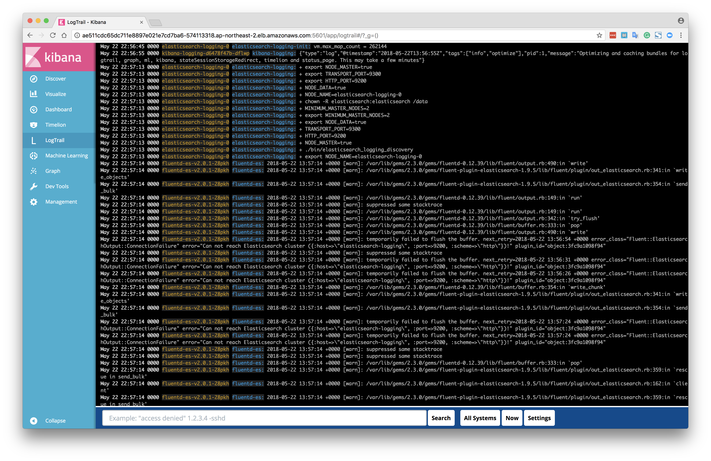

# Logging

- For more information
  - Course: [Advanced Kubernetes Course](https://www.udemy.com/learn-devops-advanced-kubernetes-usage/learn/v4/)
  - Github: [wardviaene/advanced-kubernetes-course](https://github.com/wardviaene/advanced-kubernetes-course)

Create a cluster with the name blockscale.ml:

```sh
$ kops create cluster --name=blockscale.ml --state=s3://bs-kops --zones=ap-northeast-2a --node-count=3 --node-size=t2.medium --master-size=t2.small --dns-zone=blockscale.ml
```

Apply changes to the cluster:

```sh
$ kops update cluster blockscale.ml --state=s3://bs-kops --yes
```

Identifiy Kops version:

```
$ kops version
Version 1.9.0
```


```
$ kubectl get nodes
NAME                                               STATUS         AGE       VERSION
ip-172-20-36-90.ap-northeast-2.compute.internal    Ready,master   15m       v1.9.3
ip-172-20-46-46.ap-northeast-2.compute.internal    Ready,node     13m       v1.9.3
ip-172-20-49-14.ap-northeast-2.compute.internal    Ready,node     13m       v1.9.3
ip-172-20-53-139.ap-northeast-2.compute.internal   Ready,node     13m       v1.9.3
```

Label every Kubernetes nodes with `beta.kubernetes.io/fluentd-ds-ready=true`, as otherwise the Fluentd DaemonSet will ignore them:

```yaml
nodeSelector:
        beta.kubernetes.io/fluentd-ds-ready: "true"
```

```
$ for i in `kubectl get node | cut -d ' ' -f 1 | grep internal` ; do kubectl label nodes ${i} "beta.kubernetes.io/fluentd-ds-ready=true" ; done
node "ip-172-20-36-90.ap-northeast-2.compute.internal" labeled
node "ip-172-20-46-46.ap-northeast-2.compute.internal" labeled
node "ip-172-20-49-14.ap-northeast-2.compute.internal" labeled
node "ip-172-20-53-139.ap-northeast-2.compute.internal" labeled
```

Create all resouces in the current directory:

```
$ kubectl create -f .
service "elasticsearch-logging" created
serviceaccount "elasticsearch-logging" created
clusterrole "elasticsearch-logging" created
clusterrolebinding "elasticsearch-logging" created
statefulset "elasticsearch-logging" created
configmap "fluentd-es-config-v0.1.0" created
serviceaccount "fluentd-es" created
clusterrole "fluentd-es" created
clusterrolebinding "fluentd-es" created
daemonset "fluentd-es-v2.0.1" created
deployment "kibana-logging" created
service "kibana-logging" created
storageclass "standard" created
```

List all pods in ps output format with the namespace `kube-system`:

```
$ kubectl get pods --namespace=kube-system
NAME                                                                       READY     STATUS    RESTARTS   AGE
dns-controller-657fc7fc9d-5479h                                            1/1       Running   0          25m
elasticsearch-logging-0                                                    1/1       Running   0          12m
elasticsearch-logging-1                                                    1/1       Running   0          11m
etcd-server-events-ip-172-20-43-250.ap-northeast-2.compute.internal        1/1       Running   0          24m
etcd-server-ip-172-20-43-250.ap-northeast-2.compute.internal               1/1       Running   0          24m
fluentd-es-v2.0.1-28pkh                                                    1/1       Running   0          12m
fluentd-es-v2.0.1-5bbc4                                                    1/1       Running   0          12m
fluentd-es-v2.0.1-7kf6c                                                    1/1       Running   0          12m
kibana-logging-d6478f47b-dflwp                                             1/1       Running   0          12m
kube-apiserver-ip-172-20-43-250.ap-northeast-2.compute.internal            1/1       Running   0          24m
kube-controller-manager-ip-172-20-43-250.ap-northeast-2.compute.internal   1/1       Running   0          24m
kube-dns-7785f4d7dc-n465c                                                  3/3       Running   0          25m
kube-dns-7785f4d7dc-zdpw5                                                  3/3       Running   0          22m
kube-dns-autoscaler-787d59df8f-qzdfn                                       1/1       Running   0          25m
kube-proxy-ip-172-20-36-199.ap-northeast-2.compute.internal                1/1       Running   0          23m
kube-proxy-ip-172-20-40-228.ap-northeast-2.compute.internal                1/1       Running   0          22m
kube-proxy-ip-172-20-43-250.ap-northeast-2.compute.internal                1/1       Running   0          24m
kube-proxy-ip-172-20-54-46.ap-northeast-2.compute.internal                 1/1       Running   0          22m
kube-scheduler-ip-172-20-43-250.ap-northeast-2.compute.internal            1/1       Running   0          24m

```

Now we have all the logs centralized with LogTrain plugin:



## Links

- [Kubernetes Logging Architecture](https://kubernetes.io/docs/concepts/cluster-administration/logging/)
- [KubeCon 2018 - Getting Started with Logging in Kubernetes](https://youtu.be/7qL5wkAaSh4) (2018.05)
- [KubeCon 2018 - Fluentd Deep Dive](https://youtu.be/TqW-b60AiNk) (2018.05)
- [Get Kubernetes Logs with EFK Stack in 5 Minutes](https://akomljen.com/get-kubernetes-logs-with-efk-stack-in-5-minutes/) (2018.04.22)
- [An Introduction to Kubernetes Logging](https://logz.io/blog/kubernetes-logging/)